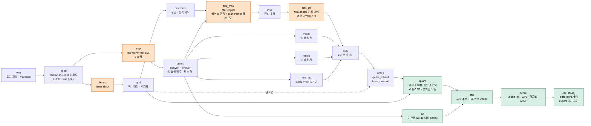
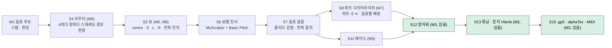

# bandscribe

> **English summary.** bandscribe is a personal, local Windows tool whose goal is to turn one band recording into
> one guitar tab per part plus a bass tab (drum and piano scores come later). Today (milestone M3 of M0–M12) it
> separates 6 stems, transcribes guitar and bass, quantises them onto the beat grid, picks the tuning, assigns
> strings and frets by Viterbi, and writes a **bass tab** and a **staff for all guitars together** (alphaTex, Guitar
> Pro 5, MIDI) that a local alphaTab viewer plays in sync with the original recording. Splitting several guitars into
> parts, the core of the project, is planned for M6–M8 (`--parts 1` already frets the merged guitar as one part).
> Engineering highlights: a one-model-at-a-time GPU worker inside Windows Job Objects, a content-addressed stage
> cache, pre-registered experiments judged with song-block bootstrap CIs (the fretting model was chosen that way:
> 74.6 % string/fret agreement per note on GuitarSet vs 55.9 % for the open-source tuttut), and a sampled presence
> pass that cut a full run from 12–25 min to 6–8 min per song on an RTX 2060. The documentation is in Korean.

밴드 녹음 한 곡을 넣으면 **기타 파트마다 탭 하나와 베이스 탭**을 만드는 것이 목표인 Windows 로컬 도구다.
드럼·피아노 악보는 그 다음 계획이다. 기타가 두 대 이상인 곡에서 "누가 어떤 음을 쳤는가"는 오디오 분리만으로는
거의 가를 수 없다. 그래서 bandscribe는 분리와 전사로 음표 후보와 증거(스테레오 위치, 음색 클래스, 반복, 기호 규칙)를
모은 뒤 **음표 하나하나를 파트에 배정**하도록 설계했다. 지금은 M3까지 구현되어 6 스템 분리, 기타·베이스 전사,
양자화, 튜닝 추정, 줄·프렛 배정을 거쳐 **베이스 탭과 기타 전체 오선보**(alphaTex·Guitar Pro 5·MIDI)를 만들고,
원곡에 맞춰 커서가 움직이는 로컬 뷰어로 보여 준다. **기타 파트 분리는 아직 없다**(합친 기타를 한 대로 보고 탭을
만드는 `--parts 1` 은 있다).

- 설계서: [`docs/DESIGN.md`](docs/DESIGN.md) · 구현 명세: [`docs/M0_SPEC.md`](docs/M0_SPEC.md), [`docs/M1_M2_SPEC.md`](docs/M1_M2_SPEC.md)
- 실험 등록부: [`docs/decisions.md`](docs/decisions.md) · 현재 상태와 측정 기록: [`docs/PROGRESS.md`](docs/PROGRESS.md)

## 목차

1. [지금 되는 것과 아직 안 되는 것](#지금-되는-것과-아직-안-되는-것)
2. [마일스톤](#마일스톤)
3. [파이프라인](#파이프라인)
4. [설계 결정과 이유](#설계-결정과-이유)
5. [측정 결과](#측정-결과)
6. [실행 방법](#실행-방법)
7. [법적 고지와 개인 사용](#법적-고지와-개인-사용)
8. [폴더 구조](#폴더-구조)
9. [테스트](#테스트)

## 지금 되는 것과 아직 안 되는 것

`bandscribe run <파일|URL>`(기본 프로필 `quality`, 기본 `--until score`)가 `jobs/<작업>/export/` 에 만드는 것:

| 결과 | 설명 |
|---|---|
| 악보 `tab/score.alphatex` | 모든 트랙: **Guitar (all parts)** 는 오선보(파트를 아직 못 나누므로 운지 없음), **Bass (raw)** 는 탭. 마디마다 원곡 시각(`\sync`)이 붙어 있다 |
| `tab/score.gp5` | Guitar Pro 5(TuxGuitar 등에서 열림). 운지된 트랙만 들어간다(기본: 베이스. `--parts 1` 이면 기타도) |
| `tab/*.txt` | 운지된 트랙의 텍스트 탭(대략적인 미리보기) |
| 튜닝 | 기타·베이스 함께 추정(표준·드롭·반음/온음 다운·카포·오픈 튜닝, 7현은 D2 아래 음이 있을 때만). `tab/tab.json` |
| MIDI | 연주 그대로(`guitar_all.mid`, `bass_raw.mid`)와 양자화판(`*_quantized.mid`) |
| 6 스템 | vocals, drums, bass, guitar, piano, other (+ `nonvox` = 믹스 − 보컬·드럼·베이스, `leftover` = 믹스 − 6 스템 합) |
| 박·마디 격자 | Beat This! 비트·다운비트에 자체 후처리(한 박을 두 번 잡은 비트 합치기, 곡 안의 반/배 박 전환 정리, 동적 계획법 마디선)를 더한 템포맵·박자표 |
| 편성 추정 | 악기 클래스별 존재 확률(`instrumentation.json`, 건반·신스·현악 등). 기타 전사의 악기 마스크를 정하는 데 쓴다 |
| 연습용 반주 | 기타 뺀 믹스, 베이스 뺀 믹스, 베이스 스템. 분리 오차가 그대로 남는다 |

`bandscribe view <작업>` 이 악보를 브라우저로 연다(127.0.0.1 에서만). 원곡을 재생하면 커서가 따라가고, 악보를 누르면 그
위치로 이동한다. 속도를 50–100 % 로 늦출 수 있다(음높이 유지). 怪獣の花唄 곡 전체에서 커서와 박 격자의 차이는 최대
31 ms였다(박 격자 자체가 틀린 구간은 아래 「원곡 동기」 참고).

**편집(M4a):** 같은 화면에서 음을 누르고 키보드로 고친다. 음을 고른 뒤 한 번씩 누르면 된다.

| 키 | 하는 일 |
|---|---|
| ← → | 앞 / 뒤 음 |
| ↑ ↓, Shift + ↑ ↓ | 반음, 옥타브 올리기·내리기 |
| Delete | 지우기 |
| S (Shift+S) | 같은 음을 다른 줄에서(탭 트랙). 고른 자리는 고정되고, 이웃 음의 운지가 그에 맞춰 바뀐다 |
| 1 / 2 | 기타 / 베이스 트랙으로 옮기기 |
| A | 재생 위치에 음 넣기(고른 음 높이, 16분음표) |
| [ / ] | 이 마디의 첫 박을 한 박 앞 / 뒤로(뒤 마디도 함께) |
| D | 지금이 마디 첫 박(재생 중에는 모았다가 멈추면 적용) |
| Ctrl+Z / Ctrl+Y | 되돌리기 / 다시 |

고칠 때마다 작업 폴더의 `edits.jsonl` 에 한 줄씩 남고, `export` 의 악보(alphaTex·GP5·텍스트 탭·양자화 MIDI·score.json)가
그 결과로 바로 바뀐다. 그래픽카드 단계는 다시 돌지 않는다(편집 한 번 0.3–0.6 초, 마디선 이동 약 1.4 초). `bandscribe run` 을
다시 해도 편집은 다시 적용되고, 새 결과에서 찾지 못한 편집은 경고한다. 읽기만 하려면 `--read-only`.

함께 있는 도구:

- `bandscribe doctor`: GPU 셀프테스트, ffmpeg 빌드 옵션, Node, 디스크, NVML 등 환경 점검. 필수 항목이 실패하면 종료 코드 1.
- `bandscribe bench gpu`: 백엔드·설정 칸마다 VRAM과 실시간 배수를 재서 VRAM 사전 점검 표를 만든다.
- `bandscribe eval ...`: 지표, 곡 블록 부트스트랩 비교, 사전 등록 실험 러너, 외부 결과 가져오기, 방해 소리별 기타 오류 측정
  (`eval run --suite distractors`).
- `bandscribe gt ...`: Guitar Pro 정답 가져오기(반복·다른 엔딩 펼침), 참조 렌더, DTW 정렬, 다운비트 탭 보정.
- `bandscribe data ...`: 평가용 데이터셋(Cambridge-MT, EGDB, GuitarSet, IDMT-SMT-Bass, FiloBass, MedleyDB) 받기·검증·로더.

**아직 없는 것:** 기타 파트(Line) 분리(M6–M8; 그래서 기타는 오선보만), 베이스 완성(M5: 옥타브 앵커, 슬라이드 같은 주법),
A/B 믹서·검토 큐(M4b), 화면에서 튜닝·박자표 바꾸기(지금은 `hints.toml`), 주법·코드 차트(M9). 드럼·피아노 악보는 v1 범위 밖이다.

## 마일스톤

각 마일스톤이 끝날 때마다 그 시점에 쓸 수 있는 도구가 남도록 나눴다. 순서는 M0 → M1a → M2 → M3 → M4a → M5 → M6 →
M7a → M4b → M7b → M7c → M8 → M9 → M10 → M11 → (M12)이고, M1b는 M1a 뒤로 계속 병행한다.

| | 내용 | 상태 |
|---|---|---|
| **M0** | 기반: 환경 점검, 입력(파일·YouTube), 콘텐츠 주소 캐시, DAG 실행기, Job Object GPU 워커 | **완료** |
| **M1a** | 측정 도구: 지표, 곡 블록 부트스트랩, 사전 등록 실험 러너, 정답 가져오기·DTW 정렬, 합성 리믹스, 데이터셋 로더 | **완료** (인수 13/13, 태그 `m1a`) |
| **M1b** | Tier A: 실제로 치는 곡의 구간 정답(Guitar Pro) 구축 | 대기: 후보 5곡 등록, 정답 파일 필요 |
| **M2** | 첫 수직 슬라이스: 분리, 전사, 편성 추정, MIDI, 연습용 반주, GPU 벤치 | **완료, 알려진 한계 있음** (인수 25개 중 통과 19 · 미달 3 · 보류 3, 태그 `m2`; [인수 문서](docs/acceptance/M1a_M2.md)) |
| **M3** | 첫 탭: 양자화, 튜닝·Viterbi 운지, .gp5/alphaTex 내보내기(기타는 합친 트랙, 베이스는 원시 탭), 원곡 동기 뷰어 | **완료, 알려진 한계 있음** (기준 13개 중 통과 9 · 미달 1 · 보류 3, 태그 `m3`; [인수 문서](docs/acceptance/M3.md)) |
| **M4a** | 편집 UI(뷰어 위 키보드 편집, 수정 로그, 다시 내보내기) | **완료, 알려진 한계 있음** (기준 5개 중 통과 4 · 보류 1, 태그 `m4a`; [인수 문서](docs/acceptance/M4a.md)) |
| M5 | 베이스 완성: 옥타브 앵커, 튜닝 후보, 주법 | 다음 |
| **M6** | 스테레오 라우터와 공간 경로: **첫 자동 기타 파트 분리** | 계획 (핵심) |
| **M7a** | Part 뷰: 파트 수(K) 추정, 음표별 배정, 미배정(Unassigned) 트랙 | 계획 (핵심) |
| M4b | A/B 믹서, 검토 큐 | 계획 |
| **M7b** | 정체성 추적: 트랙렛, 재식별, HMM 평활 | 계획 (핵심) |
| M7c | Role/Player 뷰(연주자 수에 맞춘 트랙 배치) | 계획 |
| M8 | 좁은 믹스(모노·같은 위치) 경로, 반복 차감 | 계획 |
| M9 | 주법, 코드 차트, GP7 백킹 | 계획 |
| M10 | 수정 로그로 배정 가중치·신뢰도 보정 | 계획 |
| M11 | YouTube 편의 기능(앨범판 찾기, 트리밍) | 계획 |
| M12 | (선택) 자체 모델 학습. 평가가 한계를 보일 때만 | 조건부 |

각 마일스톤의 산출물과 완료 기준은 [`docs/DESIGN.md`](docs/DESIGN.md) §10에 있다.

## 파이프라인

### 지금 (M3, 17단계)

입력 처리(ingest) 뒤에 17단계가 돈다. 주황색이 GPU 단계다. 주요 의존만 그렸고, 정확한 의존 관계는
[`bandscribe/pipeline/graph.py`](bandscribe/pipeline/graph.py)에 있다. M3 단계(초록)는 모두 CPU 이고 곡당 몇 초다.



`notes` 는 MuScriptor 가 무음 스템 위에 지어낸 음을 뺀다(`amt.silence_gate_db`). 편집은 단계가 아니다: 뷰어와
`bandscribe run` 이 `edits.jsonl` 을 단계 결과 위에 다시 재생해 export 를 고친다(마디선 편집은 양자화부터, 음 편집은 운지부터
다시 계산하고 GPU 단계·튜닝 탐색은 다시 하지 않는다).

### 계획 (M4–M8)

M3 의 양자화·튜닝·운지·내보내기(초록)는 이미 있다. 그 앞에 파트 분리가 들어간다.



단계별 입력·출력·위험은 [`docs/DESIGN.md`](docs/DESIGN.md) §2–§3에 있다.

## 설계 결정과 이유

### 1. 오디오로 리드·리듬을 가르지 않고, 분리 → 전사 → 음표 단위 배정

- **결정:** 기타 스템을 파트별 오디오로 쪼개려 하지 않는다. 여러 "뷰"(centre, S, L, R, 반복 잔차)에서 전사한 음표에
  증거를 모아 **음표마다** 어느 파트(Line)의 것인지 늦게 정한다. 파트별 오디오는 연습용 부산물로만 둔다.
- **이유:**
  - 설계 조사에서 같은 음색 기타 2대의 실녹음 분리는 두 번째 기타가 0.2–1.4 dB SDR(GuitarDuets)에 그쳤다. 추정 음표로
    조건화해도 1.01 → 1.04 dB였다.
  - 검증된 공개 lead/rhythm 분리 모델이 없다. 커뮤니티 모델은 지표가 없고, 상용 서비스는 비공개 세트 수치뿐이다.
  - 산출물은 오디오가 아니라 탭이다. "이 음을 어느 파트가 쳤나"만 맞히면 된다.
- **먼저 정한 것:** 출력 계약 R1–R9. 예: 더블 트래킹은 파트 하나, 유니즌 음은 양쪽 파트에 모두 적기, 비기타는 절대 파트가
  아님, 한 파트는 한 사람이 칠 수 있어야 함. 정답 세트도 같은 규칙으로 만든다.
- 기타 파트 수(K)를 세는 발표된 방법은 없다(관련 연구는 모두 K를 입력으로 받는다). 그래서 강건한 하한과 사전분포로
  K를 추정하는 부분은 자체 구현이다(M7a). 자체 lead/rhythm 분리기 학습은 평가가 필요를 보일 때만 한다(M12).
- 근거: [`docs/DESIGN.md`](docs/DESIGN.md) §1.3, §1.4, §4.

### 2. 스테레오: 팬 위치가 아니라 L/R coherence로 경로를 고른다 (M6, 설계 단계)

- **결정:** 4마디 창마다 S/M 에너지비, 에너지 가중 L/R coherence, |ILD| 비율, 1–40 ms 지연 상호상관으로 경로를 고른다.
  경로는 R0 좁음, R1 ADT, R2 넓은 더블, R3 다른 위치의 다른 파트이고, 경로마다 다른 뷰와 분할 규칙을 쓴다.
- **이유:** 합성 실험([`router_exp.py`](docs/research/experiments/router_exp.py))에서 bin별 ILD(팬)는 리듬 더블 구간
  에너지의 56 %를 '센터'로 잘못 봤다. 좌우로 벌린 리듬 더블은 양쪽 에너지가 비슷해서 레벨 차이로는 가운데 있는
  것처럼 보인다. 하지만 서로 다른 두 테이크라 좌우 coherence가 낮고, 가운데 놓인 모노 음원은 coherence가 높다.
- **지금 상태:** 특징 추출([`analysis/stereo.py`](bandscribe/analysis/stereo.py))은 연구 스크립트를 그대로 옮겼고,
  원본과 ±0.02 안에서 같은지 테스트한다. 라우터 자체는 M6이다. 분리기가 스테레오 정보를 보존하는지가 이 설계의
  전제라서, 그 측정(`stereo-preservation`)을 먼저 사전 등록해 뒀다(아직 실행 전).
- 근거: [`docs/DESIGN.md`](docs/DESIGN.md) §4.5, S4.

### 3. GPU에는 모델 하나: Job Object 워커, 프로세스가 모두 끝날 때까지 락 유지

- **결정:** CLI(core 환경)는 torch를 import하지 않는다(테스트로 강제). GPU 단계는 gpu 환경의 자식 프로세스가 모델 하나를
  로드해 그 단계의 입력을 모두 처리하고 종료한다. 종료하면 VRAM이 통째로 반환된다.
- **이유:** Windows의 venv `python.exe`는 런처다. 실제 인터프리터를 자식으로 띄운다. 런처만 끝내면 VRAM을 쥔 자식이 남고,
  다음 워커는 OOM 대신 NVIDIA Sysmem Fallback에 빠져 조용히 느려진다(설계 조사상 약 10배).
- **구현:**
  - ctypes로 만든 Job Object(`KILL_ON_JOB_CLOSE`)에 워커를 넣는다. `CREATE_SUSPENDED`로 띄워, 런처가 자식을 만들기 전에
    Job에 들어가게 한다.
  - `data/gpu.lock`은 **Job 안의 프로세스가 모두 끝날 때까지** 쥔다. 타임아웃·Ctrl+C에서도 트리 전체를 끝낸 뒤에 푼다.
    예외는 하나다: 드라이버에 걸려 끝나지 않는 프로세스는 70초 뒤 포기하고 락을 풀되, 그 실행을 실패로 기록하고 오류를 남긴다.
  - 이전 보유자가 강제 종료됐으면 pid 기록을 보고 그 프로세스들이 사라질 때까지 기다린다(종료에 9–38 ms 걸리는 것을 쟀다).
  - 시작 전에 NVML로 여유 VRAM을 재서 설정 사다리(예: 분리 청크 588,800 → 352,256 → 262,144)에서 맞는 칸을 고르거나
    기다린다(한 단계의 대기는 모두 합쳐 최대 1시간, 5분마다 아직 기다린다고 알린다). Windows 성능 카운터의 Shared Usage
    증가로 Sysmem Fallback을 감지한다: 모델이 올라간 뒤 늘어나는 것뿐 아니라, 모델을 올리는 동안 넘친 것(로드 직후 값 − 로드
    전 값 > 48 MB)도 실패로 본다. 벤치에서 로드 중에 넘친 칸이 실시간의 1/4–1/6 속도로 받아들여진 일이 있어서다. 넘친 칸
    아래 칸이 느리면 그것도 실패로 보고 기다린다(MuScriptor는 음 수에 따라 속도가 달라 느림만으로는 실패로 보지 않는다).
  - MuScriptor 업스트림 로더는 가중치를 GPU에 두 벌 올려 reserved 2.39 GB가 들었다. state dict를 CPU에서 읽는 로더로
    1.74 GB로 줄였고, 업스트림과 같은 음표를 내는지 패리티 테스트를 통과한 뒤에 기본값으로 바꿨다.
- 근거: [`docs/DESIGN.md`](docs/DESIGN.md) §9.5, [`gpu.py`](bandscribe/gpu.py), [`winjob.py`](bandscribe/winjob.py),
  [`tests/test_gpu_runner.py`](tests/test_gpu_runner.py).

### 4. 콘텐츠 주소 단계 캐시

- **결정:** 단계 키 = sha256(단계 이름, 코드 버전, 해석된 파라미터, 입력 해시, 모델 SHA256). 결과는
  `jobs/<작업 키>/stages/<단계>/<키 앞 12자>/`에 둔다. 작업 키는 파일이면 PCM 해시, YouTube면 동영상 ID다. 같은 오디오를
  다른 이름이나 다른 컨테이너로 넣어도 같은 작업이 된다.
- **이유:** GPU 단계 하나가 곡당 몇 분씩 걸린다. 파라미터만 바꾼 재실행이 앞 단계를 다시 계산하면 안 되고, 반쯤 쓴
  결과를 완료로 착각해서도 안 된다.
- **구현:** 임시 폴더에 manifest까지 다 쓴 뒤 폴더 rename 한 번으로 공개한다. 파라미터 변형은 나란히 남아 A/B 비교가 쉽다.
  내보낸 WAV는 캐시 파일에 하드링크하고 읽기 전용으로 둔다. MIDI는 복사해서 DAW에서 고쳐도 캐시가 바뀌지 않는다.
- **효과:**
  - 13단계가 모두 캐시면 `run --until notes`가 약 0.8초에 끝난다.
  - 패키지 이름 변경과 폴더 이동 뒤에도 단계 키 1,755개 중 바뀐 것이 0개였다. 몇 시간 분량의 GPU 결과를 그대로 다시 썼다.
  - GPU 전사가 캐시된 상태에서 하류 단계를 강제로 다시 계산하면 결과 파일이 byte 단위로 같았다(1곡에서 확인).
    GPU 단계 자체(fp16 autocast, 자기회귀 디코딩)는 비트 단위로 결정적이지 않다.
- 근거: [`docs/DESIGN.md`](docs/DESIGN.md) §9.3, [`jobs/store.py`](bandscribe/jobs/store.py),
  [`docs/RENAME.md`](docs/RENAME.md).

### 5. 사전 등록 실험과 곡 블록 부트스트랩

- **결정:** 기본값은 모두 [`docs/decisions.md`](docs/decisions.md)의 실험(E#)으로 정한다. **첫 실행 전에** 주 지표,
  최소 검출 효과(MDE), 데이터, 분할, 분석 방법, 결정 규칙을 적는다. 실행한 뒤에는 바꾸지 않고, 바꾸려면 새 id로 다시
  등록한다.
- **판정 규칙:**
  - 95 % CI는 곡(또는 클립·연주자) 단위 블록 부트스트랩 10,000회로 낸다. 같은 곡의 음표끼리는 독립이 아니기 때문이다.
  - 채택하려면 CI가 0을 제외하고, 점추정이 MDE 이상이고, 어떤 시나리오 하위 세트에서도 명백히 나빠지지 않아야 한다.
  - CI가 0을 포함하면 "판단 보류"로 적고 기본값을 유지한다. 선택은 dev에서 하고, test는 확인에만 쓴다.
  - [학습 데이터 오염 표](docs/eval/contamination.md)에서 모델이 학습했을 수 있는 세트(불명 포함)로는 절대 성능을
    주장하지 않는다.
- **지금까지:** 7건을 실행해 채택 2건(E23, latency), 기각 1건(E3c), 판단 보류 4건(E1, E2, E3, gate-m2)이다.
  E24-sep·E24-amt는 GPU 비용 때문에 M2에서 돌리지 않고 판단 보류로 닫았고, E3b는 사전 등록만 했다. stereo-preservation은
  서술 측정으로 돌렸다(스템 FLAC 보관 오차 −137~−148 dB; 합성 장면 4개 중 3개는 SW가 합성 기타를 기타 스템으로 보내지 않아 정보 없음).
  서술 측정 `distractors`(방해 소리별 오류, 아래 8)도 사전 등록한 뒤 실행했다.
  gate-m2는 수치상 문턱을 넘었지만 오염 규칙 때문에 통과로 쓰지 않았다(아래 측정 결과).
- `bandscribe eval exp <id>`가 등록부를 읽어 실행하고, 이미 결정된 항목은 다시 실행하지 않는다.

### 6. 표본 존재 패스: 편성은 "있는지"만 알면 된다

- **문제:** 기타 전사의 악기 마스크를 정하려고 piano+other 스템 전곡을 MuScriptor로 전사했다. 패드가 많은 곡은 오디오
  1초에 약 3초가 걸려(4.6분 곡에 864초) 파이프라인 대부분을 차지했다. 전체 믹스 전사(기준선 B0)도 기본 경로에서 돌았다.
- **결정:**
  - B0는 기본 프로필에서 빼 `eval` 프로필의 추가 출력으로 옮겼다. 평가용 출력이 평가 대상을 바꾸지 않도록, `eval`도
    편성과 기타 전사는 `quality`와 똑같이 정한다.
  - piano+other는 마디 시작에 맞춘 10초 창을 최대 6개(곡의 20 %, 60초 이하)만 전사한다. 창은 결정적으로 고른다:
    활성 스템을 먼저 덮고, 서로 떨어뜨리고, 다른 구간을 우선한다.
  - 오검출을 막는 조건: 한 클래스가 8음 이상, 두 구간 이상에서 나오고, 그 클래스의 스템이 마디의 10 % 이상 활성이어야
    "있음"으로 본다.
- **효과(RTX 2060, `quality`, 처음부터 실행한 단계 시간 합):** 곡당 12.4–24.6분 → 5.7–7.7분(1.8–3.2배).
  해당 단계(`amt_ms1`)만 보면 394–1,205초 → 10–46초다(베이스 패스가 캐시된 경우).
- **한계:** 창 밖에서만 연주되는 파트는 놓친다. 기타 마스크에는 안전한 쪽의 실패다(마스크가 기타만으로 남는다). M6의
  블리드 감점은 전곡 음표가 필요해서 전곡 패스를 따로 요청해야 한다.
- 근거: [`amt/presence.py`](bandscribe/amt/presence.py), [`docs/PROGRESS.md`](docs/PROGRESS.md) "Speed and presence fix".

### 7. 발견: 악기 마스크의 효과는 곡마다 다르다(블리드를 거르기도, 출력만 뒤섞기도 한다)

MuScriptor의 `instruments` 인자는 조건이면서 동시에 나머지 악기를 하드 마스크한다. 기타 스템에 샌 건반 소리를 건반
클래스로 받아 내려고 마스크를 넓혀 봤다. 정답 악보가 없어서, 원곡의 기타 음 중 **기타를 뺀 반주에서도 나오는 음**
(같은 음높이, onset ±50 ms)을 블리드로 보고 비교했다.

| 곡 | 마스크 변경 | 기타 음표 수 | 블리드 비율 | 예전 출력에서 남은 음: 진짜 음 / 블리드 |
|---|---|---|---|---|
| KH | 기타만 → + electric_piano | 3,543 → 2,307 (−35 %) | 17.7 % → 11.9 % | 1,050/2,916 (36 %) / 239/627 (38 %) |
| aotonat | 건반 4종 → 3종 (chromatic_percussion 제외) | 3,649 → 4,796 (+31 %) | 17.0 % → 17.7 % | 1,372/3,029 (45 %) / 476/620 (77 %) |

- 이 두 곡에서는 마스크를 바꾸면 블리드만 골라 지워지지 않고 출력 전체가 바뀌었다. 진짜 음과 블리드가 비슷한 비율로
  남거나(KH), 블리드가 더 많이 남았다(aotonat). KH에서 블리드 비율이 줄어든 대가로 진짜 기타 음이 최대 약 530개 사라졌을 수 있다.
- 일반적인 결론은 아니다: 멀티트랙 정답으로 잰 E3c(아래 8)에서는 피아노가 뚜렷한 구간에서 건반 마스크가 피아노 블리드를
  실제로 걸러 F1이 14점 올랐다. 마스크의 효과는 곡·구간마다 다르다.
- 그래서 마스크를 넓히는 대신 전사 **뒤에** 음표 단위로 블리드를 감점하는 쪽(S7)을 택했다. 기본 마스크는 E3에서 정한
  `guitar+present`로 두고(E3c도 유지), 곡을 늘려 정답 데이터로 판정할 E3b를 사전 등록했다.
- 한계: 비교에 쓴 반주는 다른 도구로 기타를 지운 것이라 불완전하다. 곡은 개발 PC의 상용곡이고 문서의 곡 코드로 적었다.
- 근거: [`docs/PROGRESS.md`](docs/PROGRESS.md) "Instrumentation and guitar mask", [`docs/decisions.md`](docs/decisions.md) E3, E3b, E3c.

### 8. 방해 소리 측정: 어떤 소리가 기타 오검출·누락을 만드는가

J-pop·J-rock 밴드 녹음에는 기타 위에 신스 패드·리드, 건반, 현악, 효과음이 겹친다. "반주에서도 나오는 음의 비율" 하나로는
어떤 소리가 문제인지 알 수 없어서, 멀티트랙으로 소리를 하나씩 더하고 빼며 제품 경로 전체를 다시 돌리는 측정을 만들었다
(`bandscribe eval run --suite distractors`, 설계서 8.8).

- **방법:** Cambridge-MT 멀티트랙 10곡(이번에 방해 소리가 있는 록·팝 7곡을 더했다)의 75초 구간. 스템을 파일 이름으로 15개
  소리 범주로 나누고, 기본(기타·드럼·베이스·보컬) / 기본 + 범주 하나 / 전체 믹스를 같은 마스터링 게인 곡선으로 만든다. 기준은 참
  기타 스템 합의 전사라서 믹스·분리가 더한 오류만 잰다. 오검출 음마다 그 음높이 대역을 가장 크게 울린 참 스템, 놓친 음마다 그 음을
  가린 소리를 원인으로 붙이고, 분리기가 각 소리를 기타 스템으로 얼마나 흘리는지도 잰다. 들리지 않는 ‑90 dBFS 잡음만 더한 조건
  (null)으로 전사기 자체의 흔들림도 잰다.
- **결과(10곡, 곡 블록 95 % CI):**
  - 신스 패드는 일관되게 해롭다: 재현율 −3.7 [−6.1, −2.2]점, 놓친 음 +25/분. 늘어난 오검출은 대부분 '기타 자신의 타이밍·중복'
    라벨(같은 음높이 참조 음이 200 ms 안)이었고, 패드 음높이가 그대로 나온 것으로 라벨된 오검출은 적었다. 다만 이 라벨은 그 음높이
    대역에서 가장 큰 소리를 보기 **전에** 붙으므로, 패드가 기타 음을 다시 잡히게 만든 것인지 기타 자신의 분할인지는 이 측정으로
    가를 수 없다(리포트의 조건·경로별 원인 × 대역 1위 소리 표 참고).
  - 현악을 더하면 F1 −5.9 [−9.9, −2.7]점이었지만, 같은 오디오를 기타만 마스크로 전사하면 +0.5 [0.0, +0.9]점이다. 손해는 소리가
    아니라 편성 추정이 기타 패스 마스크에 넣은 클래스 때문이다. 이 측정의 구간에서는 마스크에 건반·신스 클래스가 들어간 13조건
    모두 비기타로 걸러진 음이 0개였고 F1은 평균 2.1점 떨어졌다. 그러나 이 측정에 쓰지 않은 구간으로 확인한 E3c에서는 피아노가
    뚜렷한 JetB 구간에서 건반 마스크가 피아노 블리드 191음을 걸러 F1이 14점 올랐다(61.9 → 76.3). 마스크가 아무것도 거르지
    않는다는 결론은 일반화되지 않는다.
  - 가장 큰 오류는 방해 소리가 없어도 있다: 분리된 기타 전사의 음 분할·타이밍(분당 약 70개씩)과 옥타브(분당 28–41개) 차이.
    방해 소리 음높이가 그대로 기타 음으로 나온 것으로 라벨된 오검출은 모두 합쳐 분당 약 7개다(같은 음높이 참조 음이 200 ms
    안에 있는 오검출은 대역 1위 소리와 상관없이 타이밍으로 먼저 라벨되므로 이 수에 들어가지 않는다).
  - 들리지 않는 잡음만으로도 10구간 중 2구간에서 오검출이 분당 146개 줄거나 놓친 음이 56개 늘었다. MuScriptor의 그리디 디코딩이
    일부 구간에서 불안정하므로, 곡 2–3개로 잰 범주 차이는 이 흔들림 안에 있을 수 있다.
- **다음 결정:** 기타 패스 마스크를 기타 클래스만으로 두자는 가설은 E3c(이 측정에 쓰지 않은 5개 구간)에서 기각됐다:
  `guitar_only` − 제품 마스크 Δ −2.35 [−8.22, +0.47]점. 기본값 `guitar+present`를 유지하고, 마스크 정책 전반은 곡을 늘린 E3b로
  판정한다. 그 전에 디코딩 안정화(겹치는 창 재디코딩·beam)와 S7 음 정리(분할·옥타브)를 먼저 한다.
- 근거: [`docs/PROGRESS.md`](docs/PROGRESS.md) "Distractor measurement", [`docs/decisions.md`](docs/decisions.md) distractors.

## 측정 결과

개발 PC: Windows 10, Ryzen 5 3600, RAM 16 GB, RTX 2060 6 GB. 다른 데스크톱 앱이 VRAM 1.5–2 GB를 쓰는 평소 상태에서 쟀다.

| 항목 | 결과 | 조건과 주의 |
|---|---|---|
| 분리 SDR (BS-RoFormer SW vs 참 스템) | 기타 7.6 dB · 베이스 10.0 · 드럼 7.9 · 보컬 9.0 | Cambridge-MT의 Secretariat "Over The Top" 1곡. 멀티트랙 합을 −8 LUFS로 리미터 마스터링한 믹스이고, 참 스템은 최소제곱 게인으로 맞춘 근사다. 해먼드 오르간은 piano가 아니라 other 스템으로 갔다. SW의 학습 데이터가 불명이라 진단용이다 |
| 곡당 실행 시간 | 5.7–7.7분 (이전 12.4–24.6분) | `quality`, 3.4–4.6분 상용곡 3곡, 처음부터 실행한 단계 시간 합. 가장 큰 단계는 기타 전사(141–197초) |
| 분리 단계 | 52–99초 (실시간의 3.6–5.6배) | 상용곡 5곡 + Cambridge-MT 1곡 |
| VRAM (reserved 피크) | 분리 1.69 GB · MuScriptor 1.74 GB · Beat This! 0.3–0.4 GB | 한 번에 하나만 올라간다 |
| 캐시된 재실행 | 약 0.8초 | 17단계 모두 캐시(기본 `run`, 怪獣の花唄 3회 0.81–0.82초) |
| E23 Basic Pitch 튜닝 | onset F1 66.0 → 72.6, **Δ +6.6 [+3.8, +9.9]** | EGDB 공식 test 25클립 × 앰프 렌더 5종(Basic Pitch 학습 밖). dev에서 60개 조합 중 골랐다. 업스트림 기본 최소 음 길이(127.7 ms)는 빠른 16분음표를 지운다. 최적값이 탐색 격자의 끝에 있다 |
| MuScriptor onset 지연 | 상수 −3 ms, 보정 후 \|잔차\| 중앙값 **10.9 ms** [10.5, 11.3] | GuitarSet 연주자 00–02로 추정, 03–05로 보고. 목표 10 ms에 못 미친다. 출력 시각이 10 ms 격자로 양자화돼 있고 정답 onset의 오차도 섞인다. 오염 불명이라 절대 정확도는 주장하지 않는다 |
| gate-m2 (디스토션, MuScriptor − Basic Pitch) | Δ +8.1 [+2.1, +13.5] → **판단 보류** | 문턱 +5를 넘지만, MuScriptor 학습 데이터에 EGDB가 있는지 알 수 없어 사전 등록 규칙대로 통과로 쓰지 않았다 |
| E1, E2, E3 | 판단 보류 | 라우드니스 정규화, 전사 입력 뷰, 악기 마스크. 모두 CI가 0을 포함해 기본값 유지. 여러 기타 Line이 함께 친 음을 참조에서 두 번 센 상태로 잰 수치라 편향이 있다(2026-10-05 리뷰, 이후 실험은 병합해 잰다) |
| E3c 기타 패스 마스크 단순화 | `guitar_only` − 제품 마스크 Δ −2.35 [−8.22, +0.47] → **기각** | distractors 측정에 쓰지 않은 5개 구간. 제품 마스크가 실제로 달라진 구간은 2개: JetB에서 건반 마스크가 피아노 블리드 191음을 걸러 F1 61.9(기타만) → 76.3(제품), Zeno에서는 제품 마스크가 1점 낮았다 |
| 방해 소리(distractors, 서술) | 신스 패드 재현율 **−3.7** [−6.1, −2.2]점 · 현악 F1 −5.9점(기타만 마스크로는 +0.5) · 전체 믹스 재현율 −5.6 [−10.1, −1.7]점 | Cambridge-MT 10곡 × 75초, 기준은 참 기타 스템 합의 MuScriptor 전사(절대 성능 아님). 곡이 범주당 2–3개뿐이고, 들리지 않는 잡음만으로 2/10 구간이 크게 바뀌어(디코딩 불안정) 작은 차이는 해석하지 않는다. GPU 약 62분 |
| 운지 (E12 → E12b, GuitarSet 줄 정답) | 음 단위 일치 **74.6 %** (트랙 평균 69.3점) vs tuttut 55.9 % (46.7점); 손 위치 창 모델이 v1 보다 **Δ +12.0 [+8.4, +15.3]**점 | 정답 음높이를 넣고 줄·프렛만 맞힌다. dev = 진행 1, test = 진행 2·3(20곡 블록). 솔로에서 +21점. M3 목표 75(트랙 평균)는 미달. 연주 불가능한 운지 0 |
| 양자화 (합성, 박 격자를 앎) | ±20 ms 흔들림에서 정확한 (마디, tick) **99.0 %**, ±30 ms 에서 97.8 % | 16분·32분·셋잇단이 섞인 무작위 리듬 20곡분 6,303음. 실제 곡은 정답이 없어 측정 못 함(E14) |
| 원곡 동기 | 뷰어 커서와 박 격자 차이 최대 31 ms, 곡 끝 근처 9 ms | 怪獣の花唄. 마디마다 원곡 시각을 고정(`\sync`)해서 누적되지 않는다. 마디 안은 선형이라, 비트 추적기가 배속으로 따라간 구간이 남은 마디(青と夏 2마디, AIZO 29–44 s)는 그 안에서 최대 약 350 ms 어긋난다 |
| 처음부터 실행 (fast) | 3.7분 곡 **5분 50초** | 캐시 없는 새 작업. M3 단계(기준음·양자화·튜닝·운지·내보내기) 합 13초 |

E# 실험은 각각 [`docs/decisions.md`](docs/decisions.md)에 등록 문구와 결과가 있다. 원시 측정값(작업 폴더, 실행 로그)은
원곡 오디오 분석이라 저장소에 넣지 않았다.

## 실행 방법

**요구 사항**

- Windows 10/11 x64, NVIDIA GPU. 개발과 측정은 RTX 2060 6 GB에서만 했다. gpu 환경은 torch 2.11.0+cu128을 쓴다.
- ffmpeg(libsoxr, chromaprint, ebur128 포함 빌드)와 Node.js 22 이상이 PATH에 있어야 한다.
- [uv](https://docs.astral.sh/uv/) 실행 파일을 `tools\uv.exe`에 둔다. `tools\uvw.cmd`가 Python 설치와 캐시를 저장소 폴더
  안에 둔다(`%APPDATA%`를 쓰지 않는다).
- YouTube 입력(기본으로 켜져 있음)을 쓰려면 [yt-dlp](https://github.com/yt-dlp/yt-dlp) nightly 실행 파일을
  `tools\yt-dlp.exe`에 둔다. 켜져 있는데 이 파일이 없으면 `doctor`가 실패한다. 쓰지 않으려면
  [법적 고지와 개인 사용](#법적-고지와-개인-사용)에 적은 대로 끈다.
- 디스크 여유 60 GB 이상(doctor 기준). 저장소 경로는 ASCII로 둔다.

**설치**

```bat
git clone https://github.com/bhj2837/bandscribe
cd bandscribe
:: core 환경 (Python 3.12, CLI·분석, torch 없음)
tools\uvw.cmd sync --locked --extra core --group dev
:: gpu 환경 (torch 2.11.0+cu128, MuScriptor, Beat This!)
cd envs\gpu && ..\..\tools\uvw.cmd sync --locked && cd ..\..
:: bp310 환경 (Python 3.10, Basic Pitch ONNX; 없으면 Basic Pitch 단계만 건너뛴다)
cd envs\bp310 && ..\..\tools\uvw.cmd sync --locked && cd ..\..
:: (선택) Guitar Pro 정답 가져오기·렌더용 alphaTab
cd node && npm ci && cd ..
```

**모델은 직접 받는다.** 이 저장소에는 모델 가중치가 없다. bandscribe가 받아 주는 것은 Beat This! 체크포인트
하나뿐이고(아래 2번, 받기 전에 묻는다), 나머지는 사용자가 직접 받는다. 라이선스는
[`THIRD_PARTY_NOTICES.md`](THIRD_PARTY_NOTICES.md)를 본다.

1. **MuScriptor medium** (전사, CC BY-NC 4.0, Hugging Face 게이트): 본인 계정으로 모델 페이지의 사용 조건을 직접 수락한다.
   조건에는 입력 음악에 대한 권리 보증과 면책이 들어 있다. 그다음 로그인하고 고정된 리비전을 받는다.

   ```bat
   tools\hf-login.cmd
   set HF_HOME=%CD%\data\hf
   tools\uvw.cmd tool run --from huggingface_hub hf download MuScriptor/muscriptor-medium --revision f32236969308476e01fd3aae67357de5feb05a2d
   ```

2. **Beat This! final0** (비트, MIT): `bandscribe.cmd models fetch beat_this.final0`. URL·크기·라이선스를 보여 주고 y/N을 받는다.
3. **BS-RoFormer SW** (분리): 원 업로더 계정이 삭제되어 공식 배포처가 없고 라이선스도 불명이다. 이 저장소는 배포하지
   않는다. 직접 구한 사본을 `data\models\bs_roformer_sw\`에 `BS-Rofo-SW-Fixed.ckpt`와 `.yaml`로 둔다. 기대하는 SHA256은
   [`bandscribe/defaults.toml`](bandscribe/defaults.toml)의 `sep.ckpt_sha256`이다.
4. **Basic Pitch** (보조 전사, Apache-2.0): bp310 환경의 휠에 들어 있다.

**실행**

```bat
bandscribe.cmd doctor                              :: 환경 점검 (GPU 셀프테스트 포함)
bandscribe.cmd run "C:\music\song.flac"            :: 기본: --until score, --profile quality
bandscribe.cmd run "C:\music\song.flac" --parts 1  :: 기타를 한 대로 보고 기타 탭까지
bandscribe.cmd view "C:\music\song.flac"           :: 악보를 브라우저로 보고 키보드로 고치기 (작업 키 앞부분만 써도 됨)
bandscribe.cmd run "C:\music\song.flac" --dry-run  :: 단계별 캐시 여부만 보기
bandscribe.cmd status                              :: 작업 목록
bandscribe.cmd config show                         :: 지금 적용되는 설정
```

- 결과는 `data\jobs\<작업 키>\export\`에 모인다: `tab\score.alphatex`, `tab\score.gp5`, `tab\*.txt`, `midi\*.mid`,
  `practice\*.wav`, `instrumentation.json`, `score.json`. 스템은 `stages\sep\<키>\stems\`에 있다.
- `score.gp5` 는 Guitar Pro 5 형식이라 TuxGuitar(무료)·Guitar Pro·MuseScore 에서 열린다. 한글 제목이면 cp949 로 저장한다.
- 튜닝은 자동으로 고르지만 직접 정할 수 있다: 곡 작업 폴더의 `hints.toml` 에

  ```toml
  [tab]
  guitar_tuning = "E standard"   # "Eb standard"(또는 "하프다운"), "Drop D", "D standard", "Open G, capo 2" …
  guitar_parts = 1               # 기타 탭까지 (--parts 1 과 같음)
  ```

  를 적거나 한 번만 `--set tab.guitar_tuning="E standard"`. 그 튜닝으로 낼 수 없는 음은 옥타브를 옮겨 적고 경고한다.
  자동 판정은 `tab/tab.json` 의 `auto_label` 에 남는다.
- 곡 제목은 입력 파일 이름이다. 바꾸려면 같은 `hints.toml` 에 `[hints]` 아래 `title = "곡 제목"` 을 적는다(악보·GP5·뷰어·`status`).
- 전사기(MuScriptor)는 소리가 없는 스템 위에도 음을 지어낸다. 그래서 기타·베이스 음 중 그 악기 스템이 곡의 큰 소리보다
  50 dB 넘게 작은 곳에서 시작한 음은 뺀다(`amt.silence_gate_db`, `-200` 이면 끔). 뺀 개수와 구간은
  `stages\notes\<키>\notes_summary.json` 의 `silence_gate` 에 남는다.
- 프로필: `fast`(표본 창 절반), `quality`(기본), `eval`(B0 믹스 전사와 piano+other 전곡 전사를 추가 출력으로 더함, 훨씬 느림).
- 설정 우선순위: `bandscribe/defaults.toml` → `data/config.toml` → 작업 `hints.toml` → `--set 키=값`. 틀린 키는
  무시하지 않고 오류로 멈춘다.
- GPU 작업 전에는 VRAM을 많이 쓰는 앱(브라우저, 게임)을 닫는 편이 좋다. 여유가 모자라면 기본 정책은 기다리기다.
- 평가 데이터셋은 `bandscribe.cmd data list`로 라이선스를 확인하고 `data fetch <이름>`으로 받는다.

## 법적 고지와 개인 사용

법률 자문이 아니다. 자세한 위험 검토는 [`docs/DESIGN.md`](docs/DESIGN.md) S0에 있다.

- **개인용 도구다.** 분리한 스템, 연습용 반주, MIDI, 앞으로 만들 탭은 모두 원곡의 파생물이다. 공유·재배포·상업적 이용을
  하지 않는다. 이 저장소에는 오디오, 스템, 작업 폴더, 모델 가중치가 없다(`data/`는 git에 올리지 않는다).
- **입력은 권리가 있는 로컬 파일을 권한다.** CD·구입 음원·직접 녹음한 합주가 그렇다.
- **YouTube 입력은 기본으로 켜져 있다.** 개발자 본인이 아래 위험을 검토하고 정한 기본값이다. 처음 실행하면
  `data/config.toml`이 만들어지면서 개발자의 동의 문구(2026-09-30)가 `[consent]`에 그대로 적힌다. 다른 사람에게는 이것이 그
  사람의 동의가 아니다. 위험을 직접 판단하고, 쓰지 않으려면 `data/config.toml`에 `[youtube]` `enabled = false`를 넣는다.
  - YouTube 약관은 허락 없는 다운로드와 자동 접근을 금지한다.
  - yt-dlp가 YouTube의 JS 챌린지를 푸는 방식이 해외 판례(독일 함부르크, youtube-dl 호스팅 사건)에서 기술적 보호조치
    우회로 판단됐다는 보도가 있다. 한국 저작권법에 어떻게 적용되는지는 확인하지 않았다.
  - 쿠키와 PO 토큰은 쓰지 않는다. 동영상 하나만 받고, 다운로드 사이에 5초 이상 쉰다.
- **모델 라이선스:** MuScriptor 가중치는 CC BY-NC 4.0이고 게이트 조건(입력 음악 권리 보증·면책)을 사용자가 직접
  수락한다. BS-RoFormer SW는 출처·라이선스가 불명이라 개인용으로만 쓰고 배포하지 않는다. Beat This!는 MIT, Basic Pitch는
  Apache-2.0이다. 벤더링한 MSST 모델 코드는 MIT다([`bandscribe/third_party/msst/LICENSE`](bandscribe/third_party/msst/LICENSE),
  이 코드의 원본인 lucidrains/BS-RoFormer 의 고지는 [`LICENSE.BS-RoFormer`](bandscribe/third_party/msst/LICENSE.BS-RoFormer)).
  전체 목록은 [`THIRD_PARTY_NOTICES.md`](THIRD_PARTY_NOTICES.md).
- **데이터셋:** 각 데이터셋의 약관을 따른다(예: Cambridge-MT는 교육용 약관). `data fetch`는 받기 전에 라이선스를 보여 준다.
- **이 저장소의 코드:** [`LICENSE`](LICENSE)를 따른다. 위의 모델·데이터·벤더링 코드에는 각자의 라이선스가 적용된다.

## 폴더 구조

```
bandscribe/            core 패키지 (torch import 금지)
  cli.py, commands/      CLI (typer, 한국어 출력)
  ingest/                디코드, 라우드니스, 입력 플래그, YouTube(yt-dlp.exe 래퍼)
  jobs/                  콘텐츠 주소 저장소, DAG 실행기
  pipeline/              13단계 그래프, 실행기, export 게시
  analysis/              박·마디 격자, 구간·반복, 보컬 활동, 반복 잔차, 스테레오 특징
  sep/                   분리 단계, 파생 스템·모노 뷰·연습용 반주
  amt/                   전사 단계, 표본 존재 패스, 편성 추정, 무음 게이트, MIDI 쓰기
  tab/                   양자화, 기준음, 튜닝·운지, 악보 쓰기(alphaTex·GP5·텍스트 탭), 뷰어, 편집(edits.jsonl)
  workers/               GPU·bp310 워커: sep_msst, amt_muscriptor, beats_beatthis, amt_basicpitch
  gpu.py, winjob.py      GPU 락, Job Object (ctypes)
  vram.py, sysmon.py     VRAM 사다리·대기, NVML·성능 카운터
  eval/                  지표, 블록 부트스트랩, 사전 등록 실험 러너, GP 가져오기, DTW 정렬, 합성 리믹스,
                         방해 소리 측정(스템 분류, 원인 귀속, 리포트)
  datasets/              Tier B/C 데이터셋 받기·검증·로더
  schema/                pydantic 스키마
  third_party/msst/      MSST BS-RoFormer 모델 코드 (MIT, 커밋 고정)
envs/gpu/              GPU 워커 환경 (Python 3.12, torch 2.11.0+cu128)
envs/bp310/            Basic Pitch 워커 환경 (Python 3.10, ONNX)
node/                  alphaTab (Guitar Pro 정답 가져오기·렌더)
tools/                 uvw.cmd, hf-login.cmd, yt-dlp.conf
docs/                  설계서, 명세, 진행 상황, 실험 등록부, 오염 표, 조사 자료
tests/                 pytest
data/                  (git 밖) 작업, 모델, HF·uv 캐시, 데이터셋, 실험 실행 결과
```

## 테스트

```bat
.venv\Scripts\python.exe -m pytest -q -p no:cacheprovider
```

- 테스트 1,277개. 개발 PC에서 1,276개 통과, 1개 건너뜀, 약 8분.
- GPU, gpu·bp310 환경, Node, 데이터셋, 모델, 네트워크가 필요한 테스트는 마커로 표시되어 있고, 없으면 자동으로 건너뛴다.
- 주요 대상:
  - GPU 워커 정리: 타임아웃·Ctrl+C·남은 자식 프로세스가 있을 때 트리 전체가 끝난 **뒤에** 락이 풀리는지,
    강제 종료된 이전 보유자를 기다리는지.
  - 캐시: 원자적 공개, 임시 폴더 정리, 이름 변경 전에 쓴 결과 파일 호환.
  - 지표 항등식: 항등이면 F1 1.0, 무작위 20 % 삭제면 재현율 0.80, +12반음이면 pitch F1 0·chroma F1 1.0, 라벨 교환은
    헝가리안 뒤 1.0, 시스템 격자 오류가 음표 지표에 새지 않음.
  - 업스트림·연구 코드와의 패리티: MSST 분리, MuScriptor 로더, 라우터 특징, 반복 차감.
  - core 환경이 torch를 import하지 않는지, 평가 실행이 두 번 모두 byte 단위로 같은 결과를 내는지.
  - 방해 소리 측정: 디스크의 모든 스템 이름 분류, 구간 선택, 원인을 아는 합성 신호로 원인 귀속·누출, 가짜 GPU 백엔드로 전체 실행·캐시 재사용·리포트.
